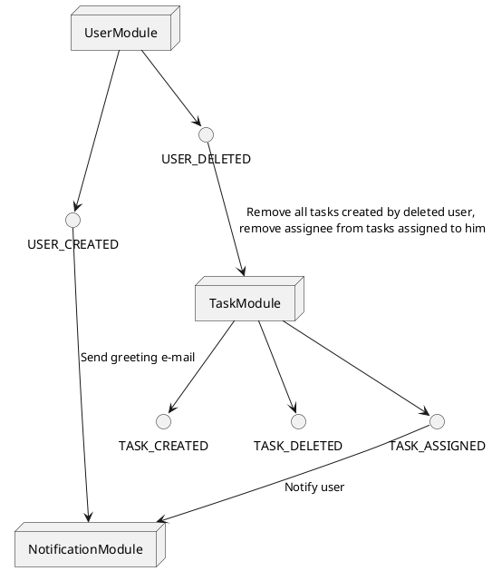
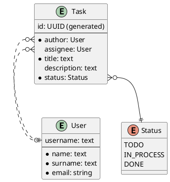

# Demo service

## API

### Authentication module

- **POST /authentication**: Authenticate
- **POST /authentication/refresh**: Refresh authentication

### User module

- **POST /users**: Register
- **POST /authentication**: Authenticate
- **POST /authentication/refresh**: Refresh authentication
- **GET /users/me**: Get information about current user
- **DELETE /users/me**: Delete current user

### Task module

- **POST /tasks**: Create task
- **GET /tasks**: Get all tasks
- **GET /tasks/{id}**: Get task
- **POST /tasks/{id}/assignee/{username}**: Assign task
- **DELETE /tasks/{id}**: Delete task

## Synchronous calls (through interfaces)

`AuthService.authenticate` -> `UserServicegetUser(username)`

## Authentication

**Authenticate**

Request:

POST /authentication

```json
{
    "username": "<username>",
    "password": "<password>"
}
```

Response:

```json
{
    "accessToken": "<token>",
    "refreshToken": "<token>"
}
```

Access token should be used in all other requests as header:
`Authorization: Bearer <access token>`

**Refresh authentication**

Request:

POST /authentication/refresh

As an auth token refresh token should be used in request header: `Authorization: Bearer <refresh token>`


## Messaging

### User module

Output events:

- **USER_CREATED**
- **USER_DELETED**


### Task module

Input events:

- **USER_DELETED** - Remove all tasks created by deleted user,
remove assignee from tasks assigned to him

Output events:

- **TASK_CREATED**
- **TASK_DELETED**
- **TASK_ASSIGNED**

### Notification module

Input events:

- **USER_CREATED** - send greeting e-mail
- **TASK_ASSIGNED** - Notify user




## Entity-relationship model




## Project structure

### Packages

* users
  * controller
  * messaging
  * service
  * model
  * repository
  * entity
  * config
* auth
  * controller
  * service
  * model
  * config
* tasks
  * controller
  * messaging
  * service
  * model
  * repository
  * entity
  * config
* notifications
  * controller
  * messaging  
  * service
  * model
  * repository
  * entity
  * config
