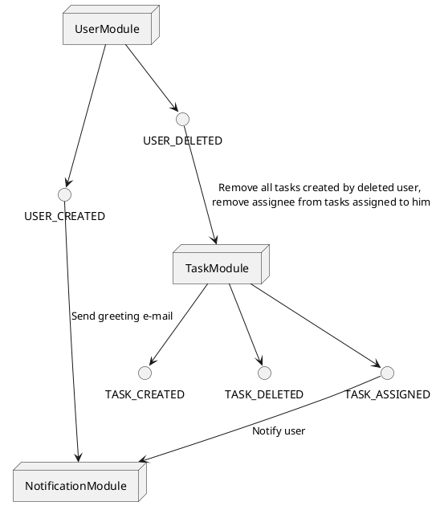
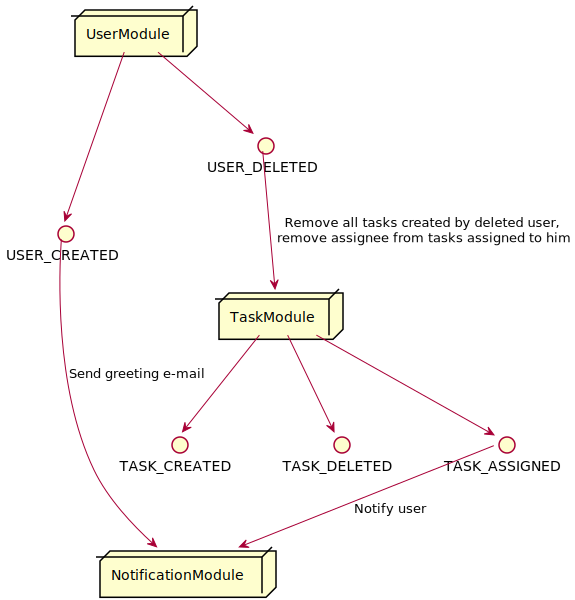
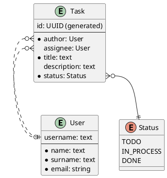
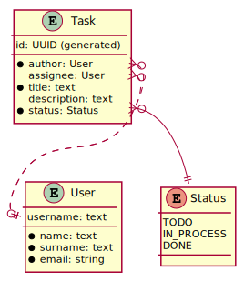

# Demo service

## Launch notes
* Create template repository with the name `GROUP-ID`-`YOUR-APP-NAME` and select this organization as an account
* Rename `name`, `description`, `github` to corresponding values in `pom.xml`
* Rename `postgres-app` to `postgres-YOUR-APP-NAME`, `image` to `ghcr.io/USERNAME/REPOSITORY` in `docker-compose.yml`
* Configure settings.xml
  * 
    * First option: settings in local maven repository (`~/.m2/settings.xml`)
    * Second option: settings in project root
  * Settings can be specified using:
    * mvn -s settings.xml
    * IDEA: Maven settings -> User settings file
  * Settings must contain dummy mirror to override default blocking mirror that blocks http
  ```
  <mirrors>
    <mirror>
      <id>maven-default-http-blocker</id>
      <mirrorOf>dummy</mirrorOf>
      <name>Dummy mirror</name>
      <url>http://0.0.0.0/</url>
    </mirror>
  </mirrors>
  ```

* For local app launch, use **dev** profile. It uses in-memory database
* For production deploy, run app with no profile
* Your app docker image will be automatically built and available at `ghcr.io/username/repository` 
* You can override app version using environment variable `APP_VERSION`, e.g. `APP_VERSION=0.1.0-SNAPSHOT docker compose up -d`
* To run project on shared instance do `cp docker-compose.override.example.yml docker-compose.override.yml`. It will join the infra network with Logstash, etc

## API

### Authentication module

- **POST /authentication**: Authenticate
- **POST /authentication/refresh**: Refresh authentication

### User module

- **POST /users**: Register
- **POST /authentication**: Authenticate
- **POST /authentication/refresh**: Refresh authentication
- **GET /users/me**: Get information about current user
- **DELETE /users/me**: Delete current user

### Task module

- **POST /tasks**: Create task
- **GET /tasks**: Get all tasks
- **GET /tasks/{id}**: Get task
- **POST /tasks/{id}/assignee/{username}**: Assign task
- **DELETE /tasks/{id}**: Delete task

### OpenAPI
* **GET /swagger-ui.html**: Swagger UI
  * Paste bearer token to Authorize window to have access to secured endpoints

## Synchronous calls (through interfaces)

`AuthService.authenticate` -> `UserService.getUser(username)`

## Authentication

**Authenticate**

Request:

POST /authentication

```json
{
    "username": "<username>",
    "password": "<password>"
}
```

Response:

```json
{
    "accessToken": "<token>",
    "refreshToken": "<token>"
}
```

Access token should be used in all other requests as header:
`Authorization: Bearer <access token>`

**Refresh authentication**

Request:

POST /authentication/refresh

As an auth token refresh token should be used in request header: `Authorization: Bearer <refresh token>`


## Messaging

### User module

Output events:

- **USER_CREATED**
- **USER_DELETED**


### Task module

Input events:

- **USER_DELETED** - Remove all tasks created by deleted user,
remove assignee from tasks assigned to him

Output events:

- **TASK_CREATED**
- **TASK_DELETED**
- **TASK_ASSIGNED**

### Notification module

Input events:

- **USER_CREATED** - send greeting e-mail
- **TASK_ASSIGNED** - Notify user






## Entity-relationship model





## Project structure

### Packages

Any module should be divided into `api` & `impl` base packages 
to define classes that can be used in other modules.

* users
  * api
    * controller
    * messaging
    * model
    * service
  * impl
    * entity
    * repository
    * service
* auth
  * api
    * controller
    * service
    * model
  * impl
    * config
    * service
* tasks
  * api
    * controller
    * messaging
    * service
  * impl
    * entity
    * repository
    * service
* notifications
  * api
    * controller
    * messaging
    * model
    * service
  * impl
    * config
    * entity
    * repository
